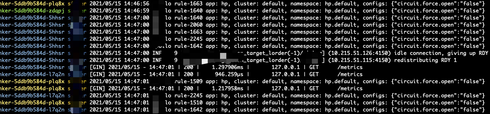

# mktail

mktail (multiple kubernetes tail) is a tool for tailing multiple kubernetes clusters pods logs.  It is based on the open source [Stern](https://github.com/wercker/stern) project . 

## Example
```bash
# tailing "demo" namespace pods (filtered by name sinker) logs in all kubernetes (kubernetes instances in all config file in ~/.kube)
mktail -n demo sinker -s 10s

# same above, but exclude containers who's name includes "sinker-test"
mktail -n demo sinker -E "sinker-test" -s 10s
```



## Features
1. multiple kubernetes support (-m option, default true)
2. visit [Stern project](https://github.com/wercker/stern) for more features

## Usage
```shell
Tail multiple pods and containers from Kubernetes

Usage:
  stern pod-query [flags]

Flags:
      --all-namespaces             If present, tail across all namespaces. A specific namespace is ignored even if specified with --namespace.
      --color string               Color output. Can be 'always', 'never', or 'auto' (default "auto")
      --completion string          Outputs stern command-line completion code for the specified shell. Can be 'bash' or 'zsh'
  -c, --container string           Container name when multiple containers in pod (default ".*")
      --container-state string     If present, tail containers with status in running, waiting or terminated. Default to running. (default "running")
      --context string             Kubernetes context to use. Default to current context configured in kubeconfig.
  -e, --exclude strings            Regex of log lines to exclude
  -E, --exclude-container string   Exclude a Container name
  -h, --help                       help for stern
  -i, --include strings            Regex of log lines to include
      --kubeconfig string          Path to kubeconfig file to use
  -m, --multiple                   enable multiple kubernetes mode (default true)
  -n, --namespace string           Kubernetes namespace to use. Default to namespace configured in Kubernetes context
  -o, --output string              Specify predefined template. Currently support: [default, raw, json] (default "default")
  -l, --selector string            Selector (label query) to filter on. If present, default to ".*" for the pod-query.
  -s, --since duration             Return logs newer than a relative duration like 5s, 2m, or 3h. Defaults to 48h.
      --tail int                   The number of lines from the end of the logs to show. Defaults to -1, showing all logs. (default -1)
      --template string            Template to use for log lines, leave empty to use --output flag
  -t, --timestamps                 Print timestamps
  -v, --version                    Print the version and exit
```

## Reference
[Kubernetes blog - Tail Kubernetes with Stern](https://kubernetes.io/blog/2016/10/tail-kubernetes-with-stern/)